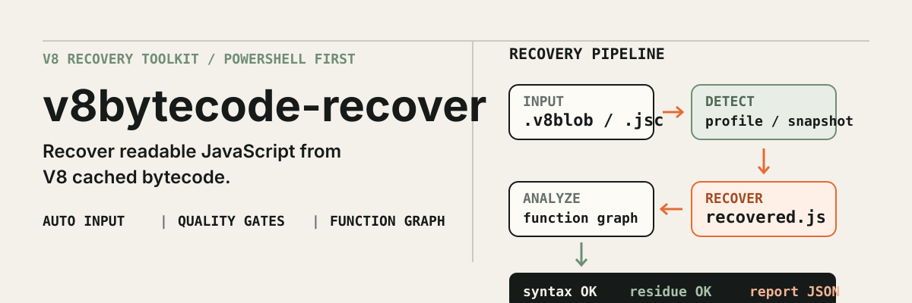

# v8bytecode-recover

<p align="center">
  
</p>

<p align="center"><strong>PowerShell-first V8 cached bytecode recovery</strong><br>由 .v8blob / .jsc 到可檢查的 JavaScript 近似源碼</p>

<p align="center">
  <a href="#繁體中文">繁體中文</a> ·
  <a href="#english">English</a>
</p>

## 繁體中文

### 它解決甚麼問題

V8 cached bytecode 通常不能直接閱讀，而且還原結果會受 V8 版本、build flags 及 startup snapshot 影響。v8bytecode-recover 將解碼、snapshot/profile 偵測、source recovery、品質檢查及分析輸出放在同一條 pipeline，讓你由一個檔案或一個目錄開始，不需要手動拼接多個工具。

本專案參考了 [xqy2006/jsc2js](https://github.com/xqy2006/jsc2js) 及 [suleram/View8](https://github.com/suleram/View8) 的 bytecode source-recovery 方向，並以 PowerShell-first 方式整理完整操作流程。

### 30 秒開始

需求：

- Windows PowerShell
- Node.js 18+
- Python 3：只在處理 raw .v8blob / .jsc 時需要
- 不需要 npm runtime dependency

最簡單的互動模式：

~~~powershell
cd D:\path\to\v8bytecode-recover
.\v8bytecode-recover.ps1
~~~

選擇 **Quick recover**，輸入檔案或目錄，其他設定使用自動預設值。

如果 Windows PowerShell 不允許執行 `.ps1`，請在專案資料夾開啟 PowerShell
後執行：

~~~powershell
powershell.exe -NoProfile -ExecutionPolicy Bypass -File .\v8bytecode-recover.ps1
~~~

如果視窗一閃即關閉，請不要直接雙擊檔案，改用上面的命令；這樣可以看到
完整錯誤訊息。Windows PowerShell 5.1 及 PowerShell 7 都支援這些入口。

主入口預設使用繁體中文；需要簡體中文互動介面時，可使用：

~~~powershell
.\v8bytecode-recover-zh-TW.ps1
.\v8bytecode-recover-zh-CN.ps1
# 或：.\v8bytecode-recover.ps1 -Language zh-CN
~~~

`inspect`、`doctor` 及 `profiles identify` 亦支援
`--language zh-TW|zh-CN`，所以兩個中文入口在非互動模式仍會保持一致。

需要在 script、CI 或批次流程使用時：

~~~powershell
.\v8bytecode-recover.ps1 -Action recover -InputPath .\input -OutputPath .\output
~~~

也可以直接使用 Node CLI：

~~~powershell
node .\bin\v8bytecode-recover.mjs .\input -o .\output
~~~

成功的輸出只會在通過 JavaScript syntax check 及 decompiler-residue check 後寫入：

~~~text
input/
└─ app.jsc

output/
├─ app.js
├─ recovery-report.json
└─ recovery-manifest.json
~~~

工具會清楚區分 **成功**、**partial** 及 **failed**，並保留可檢查的 evidence、report 或 serialized artifact。

### Pipeline

1. 偵測輸入格式：.v8blob、.jsc、disassembly text 或 .v8recovery.json
2. 自動選擇 V8 profile，並搜尋 matching startup snapshot 或附近的 versioned Node runtime
3. 解碼 bytecode，還原控制流、函式、作用域及常見 JavaScript 結構
4. 執行 syntax、residue 及 closure-binding 檢查
5. 輸出 JavaScript、報告、manifest 及可選的函式分析資料

### 輸入與輸出

| 類型 | 支援 |
| --- | --- |
| Raw input | .v8blob、.jsc |
| Text input | .disassembly.txt、.disasm.txt、.txt |
| Replay input | .v8recovery.json |
| Source output | 通過品質檢查的 *.js |
| Analysis | *.functions.json、*.callgraph.json、*.tree.json、*.inline.json、*.names.json |
| Evidence | *.disassembly.txt、*.translated.txt、*.cfg.json |
| Run state | recovery-report.json、recovery-manifest.json |

### 常用命令

查看 blob header、V8 profile、snapshot 候選及 hash：

~~~powershell
.\v8bytecode-recover.ps1 -Action inspect -InputPath .\input\app.jsc
~~~

指定 embedder 後，診斷結果會同時顯示 profile/d8 建議及 exact evidence：

~~~powershell
.\v8bytecode-recover.ps1 -Action inspect `
  -InputPath .\input\app.jsc `
  -Embedder electron
~~~

嚴格模式：任何 unresolved read-only reference 都不輸出 JavaScript：

~~~powershell
.\v8bytecode-recover.ps1 -Action recover -InputPath .\input -OutputPath .\output -Strict
~~~

輸出函式索引及 graph：

~~~powershell
.\v8bytecode-recover.ps1 -Action recover -InputPath .\input -OutputPath .\output -Emit functions,callgraph,tree,names
~~~

進階分析會維持同一個輸出目錄，不需要開啟另一套工具：

~~~powershell
node .\bin\v8bytecode-recover.mjs .\input `
  --emit functions,callgraph,tree,inline `
  --scope outer `
  --show-all `
  --inline-depth 3 `
  --inline-branch-limit 20
~~~

如果目標 blob 仍有無法安全還原的 residue，可用研究模式保留候選檔，
但不會把它誤標成可用的 `.js`：

~~~powershell
node .\bin\v8bytecode-recover.mjs .\input --research --report .\output\research.json
# 候選檔位於 .\output\.research\
~~~

產生可重用 artifact，之後可在沒有 Python 或 d8 的情況下重播：

~~~powershell
.\v8bytecode-recover.ps1 -Action recover -InputPath .\input -OutputPath .\artifacts -Emit serialized
.\v8bytecode-recover.ps1 -Action recover -InputPath .\artifacts\.analysis\sample.v8recovery.json -OutputPath .\replay -Emit functions
~~~

大型目錄可使用 resume；輸入、設定或輸出被改動時，舊結果會自動失效：

~~~powershell
.\v8bytecode-recover.ps1 -Action recover -InputPath .\input -OutputPath .\output -Resume
~~~

### Matching d8 與 profiles

內建 profile 優先處理可安全驗證的 raw bytecode。當目標 V8 build 未被內建 profile
覆蓋，或指定 Electron、Chromium、custom embedder 時，auto backend 會自動尋找
matching patched d8 並優先使用；可放在 `runtime/d8/`、`tools/d8/`、PATH，或由
環境變數指定。

若完全沒有本機 d8，recovery 會由 blob 的 version hash 直接計算對應的 V8 tag，
再下載單一個 matching patched d8 release build（約 8 MB，放在 git-ignored 的
`runtime/d8/`，同一版本只需下載一次）。這令工具即使遇到未內建的 V8 版本，
也不需要手動尋找或編譯 d8：

~~~powershell
$env:V8BYTECODE_D8 = 'D:\tools\d8-14.7.exe'   # 指定本機 d8（可省略）
node .\bin\v8bytecode-recover.mjs .\input      # 無 profile 時自動下載 matching d8
~~~

使用 `--no-d8-download` 可停用自動下載。

~~~powershell
$env:V8BYTECODE_D8 = 'D:\tools\d8-14.7.exe'
node .\bin\v8bytecode-recover.mjs .\input
~~~

也可以明確指定：

~~~powershell
.\v8bytecode-recover.ps1 -Action recover -InputPath .\input\app.jsc -Backend d8 -D8Path D:\path\to\d8.exe
~~~

專案不捆綁二進位 d8，因為它必須同時匹配 V8 tag、平台及 patched `loadjsc()`
行為；`v8bytecode-doctor` 會驗證 `loadjsc()` 是否真的存在。

查看或驗證內建 profiles：

~~~powershell
npm run profiles:list
npm run profiles:validate
node .\bin\v8bytecode-profiles.mjs identify .\input\app.jsc
node .\bin\v8bytecode-profiles.mjs coverage --corpus D:\corpus\v8 --json
~~~

由 upstream V8 tag 自動找出每條 minor line 的最新 exact tag：

~~~powershell
node .\bin\v8bytecode-profiles.mjs discover `
  --minimum 5.1.0 `
  --maximum 15.3.79 `
  --output .\temp\v8-versions.txt `
  --report .\temp\v8-versions-report.json
~~~

之後以 `--versions-file` 生成候選 profiles；只有 generation report 標記
`success` 的結果才應合併到 bundled catalog。

如果 blob 來自未內建的 V8 版本，可以用一個命令自動下載及快取相同 V8 source tag，產生並驗證 exact profile pack：

~~~powershell
node .\bin\v8bytecode-profiles.mjs generate --version 14.7.84

# PowerShell-first equivalent
.\v8bytecode-recover.ps1 -Action profiles -ProfileCommand generate -ProfileVersion 14.7.84

.\v8bytecode-recover.ps1 -Action recover `
  -InputPath .\input\app.jsc `
  -OutputPath .\output `
  -Profile 14.7.84 `
  -ProfileDirectory .\output\profiles\14.7.84
~~~

生成結果預設放在 `output\profiles\VERSION`，並附有 `profile-generation-report.json`；不會自動覆蓋 bundled profiles。要由本地 V8 repository 生成，可加上 `--source git --v8-repo D:\src\v8`。blob 只有 version hash，對未知版本仍必須提供 exact source tag 版本號。profile 生成及維護規則見 [`docs/PROFILE_GENERATION.md`](./docs/PROFILE_GENERATION.md)。

`--profile-dir` 只接受同一個 profile pack 內的 exact version/hash，不會用最近版本代替。若 source tag 的 V8 內部結構已改變，generator 會報錯，這時應使用 matching d8 或加入對應 adapter；不要把不匹配結果當成精準還原。

對未知 header layout，`inspect` 及 `profiles identify` 會掃描有限的 header 區域，
列出 hash offset、預期 offset、header validation score 及 confidence。只有
profile layout、payload bounds、padding 及 version hash 全部通過，才會宣稱 exact；
候選值仍要以 producer/build metadata 確認，不能把 hash 相同直接當成已驗證 profile。

Node、Electron、Chromium 及 custom embedder 的判定規則集中在
`engine/v8asm/cached_data/embedder-matrix.json`。對 Electron、Chromium 或
custom embedder，只有 version hash 並不足以宣稱 exact；auto backend 會優先嘗試
matching patched d8，沒有 d8 時才回退到 profile 的診斷／最佳努力路徑。

benchmark 可用同一份 corpus 同時比較 profile、d8 及 jsc2js adapter，並用 manifest
設定最低函式數、residue、profile、embedder 及 compatibility gate：

~~~powershell
node .\bin\v8bytecode-benchmark.mjs D:\corpus\v8 `
  --backends profile,d8 `
  --d8-dir .\runtime\d8 `
  --corpus-manifest .\docs\benchmarks\corpus.example.json `
  --fail-on-regression `
  --output .\output\benchmarks\v8.json
~~~

### 限制

- V8 cached bytecode 是 version、build flags 及 startup snapshot 敏感格式；匹配版本仍然重要。
- 輸出是語義近似源碼，不是原始檔案的逐字副本。
- 原始註解、排版及部分 identifier names 不存在於 bytecode 中。
- 控制流及 expressions 可能以等價但不同的形式輸出。
- 缺少 read-only snapshot 時，預設可輸出有明確標記的 partial source；使用 -Strict 可改為零容忍。
- 非 read-only residue、未知 opcode、invalid syntax 或 closure binding 問題會令該檔案失敗，不會冒充成功輸出。唯一例外是個別函式的 decompiler fallback（該函式保留為註解形式的線性 bytecode）；這會在 report 標記為 partial recovery，使用 -Strict 可改為零容忍。
- 研究模式會保留失敗候選，位置在 `.research/`；這些檔案只作人工分析，不是品質通過的 JavaScript。

### 專案結構

~~~text
v8bytecode-recover.ps1    PowerShell 主入口（預設繁體中文）
v8bytecode-recover-zh-*.ps1  繁中/簡中薄 wrapper
powershell/               PowerShell actions、menu、localization、Node runner
bin/                      recover、inspect、doctor、profiles、benchmark CLI
src/                      CLI、pipeline、analysis、backends、validation 及 reporting
engine/v8asm/             V8 profiles、cached-data decoder、source recovery
docs/                     profile 生成指南、命令例子及 benchmark 設定
test/                     Node 內建測試
~~~

### 開發與驗證

本專案沒有 runtime npm dependency：

~~~powershell
npm run check
npm test
npm run profiles:validate
python -B -m unittest discover -s engine/v8asm -p 'test_*.py'
~~~

MIT License。engine/v8asm 保留其原有 MIT 授權聲明。

## English

v8bytecode-recover is a PowerShell-first recovery pipeline for V8 cached bytecode. It turns .v8blob, .jsc, disassembly text, or validated recovery artifacts into readable approximate JavaScript, then applies syntax and decompiler-residue gates before writing source files.

The project is informed by [xqy2006/jsc2js](https://github.com/xqy2006/jsc2js) and [suleram/View8](https://github.com/suleram/View8), and focuses on a clear PowerShell-first recovery workflow.

### Quick start

Requirements:

- Windows PowerShell
- Node.js 18+
- Python 3 for raw bytecode
- No runtime npm dependency

~~~powershell
.\v8bytecode-recover.ps1
~~~

For automation:

~~~powershell
.\v8bytecode-recover.ps1 -Action recover -InputPath .\input -OutputPath .\output
node .\bin\v8bytecode-recover.mjs .\input -o .\output
~~~

The PowerShell entry point defaults to Traditional Chinese prompts. Use
`v8bytecode-recover-zh-CN.ps1` or `-Language zh-CN` for Simplified Chinese.
The inspect, doctor, and profile-identify CLIs also accept
`--language zh-TW|zh-CN` for consistent non-interactive output.

The default workflow auto-detects raw blobs, disassembly text, and .v8recovery.json artifacts. It can discover matching profiles and nearby snapshots, process mixed directories, preserve relative paths, and resume validated results through recovery-manifest.json.

Before recovery, inspect an input and see the detected header layout, hash
candidates, snapshot candidates, and embedder evidence:

```powershell
node .\bin\v8bytecode-inspect.mjs .\input\app.jsc --json
node .\bin\v8bytecode-profiles.mjs identify .\input\app.jsc --json
node .\bin\v8bytecode-profiles.mjs coverage --corpus D:\corpus\v8 --json
```

Unknown header layouts are reported as ranked evidence instead of being
silently mapped to a nearby V8 release. Node, Electron, Chromium, and custom
embedder policies are kept separate; an unverified embedder is directed to a
matching patched `d8` rather than being labelled exact.

For a V8 version outside the bundled catalog, generate and validate an exact profile pack automatically:

~~~powershell
node .\bin\v8bytecode-profiles.mjs generate --version 14.7.84
.\v8bytecode-recover.ps1 -Action recover `
  -InputPath .\input\app.jsc `
  -OutputPath .\output `
  -Profile 14.7.84 `
  -ProfileDirectory .\output\profiles\14.7.84
~~~

The generated pack is placed under `output\profiles\VERSION` with a generation report. Use `--source git --v8-repo D:\src\v8` for a local V8 checkout. A blob contains only a version hash, so an exact source-tag version is still required when the version is not already bundled. See [`docs/PROFILE_GENERATION.md`](./docs/PROFILE_GENERATION.md) for the maintenance workflow.

### What makes it useful

- Built-in profile backend for supported V8 cached-data formats.
- Optional matching patched d8 backend for builds outside the bundled profiles.
- Automatic d8 acquisition: the blob's version hash is mapped to its exact V8
  tag and a single matching patched release build is downloaded on demand
  (disable with `--no-d8-download`).
- Snapshot discovery for modern startup snapshots, legacy embedded Node
  snapshots, and read-only heaps embedded inside Node/Electron binaries.
- Quality gates that separate success, partial recovery, and failure; isolated
  per-function decompiler failures keep commented linear output instead of
  discarding the whole file (`--strict` restores zero tolerance).
- Reusable serialized artifacts for replay without Python or d8.
- Function indexes, nested hierarchy, call/reference graphs, trees, and deterministic name maps.
- Scope-limited, bounded inline, show-all research views, and preserved
  non-clean candidates under `.research/` without publishing them as `.js`.
- PowerShell menu for quick use and CLI entry points for CI or scripts.
- 130 bundled exact profiles covering V8 tags from 5.1 through 15.3, with broad minor-line coverage.
- Profile coverage and source-layout-aware profile generation for expanding the catalog.
- External two-stage benchmark adapters for patched d8 plus View8-style tools,
  with syntax, residue, function-count, profile, embedder, and byte-size gates.

Benchmark manifests can require exact metadata in addition to a successful
exit code:

```json
{
  "format": 1,
  "cases": [
    {
      "path": "node/v14/sample.jsc",
      "backend": "profile",
      "profile": "14.7.57",
      "embedder": "node",
      "compatibilityStatus": "exact-runtime-variant",
      "minFunctions": 1,
      "residueFree": true
    }
  ]
}
```

The benchmark uses the source index for function counts, so arrow functions
are included instead of relying only on the `function` keyword.

### Important limitations

V8 cached bytecode depends on its V8 version, build flags, and startup snapshot. Recovered output is a semantic reconstruction, not a byte-for-byte copy of the original source. Names, comments, formatting, optimized expressions, and some control-flow structure may not be recoverable. Use --strict when partial output is not acceptable.

### Development

~~~powershell
npm run check
npm test
npm run profiles:validate
python -B -m unittest discover -s engine/v8asm -p 'test_*.py'
~~~

## References

- [xqy2006/jsc2js](https://github.com/xqy2006/jsc2js) — reference JSC-to-JavaScript workflow.
- [suleram/View8](https://github.com/suleram/View8) — related bytecode source-recovery project.
- [V8](https://github.com/v8/v8) — upstream engine and bytecode implementation.
- [v8bytecode-recover](https://github.com/dibai111/v8bytecode-recover) — this project.

## License

MIT. The engine/v8asm directory retains its original license notice.


