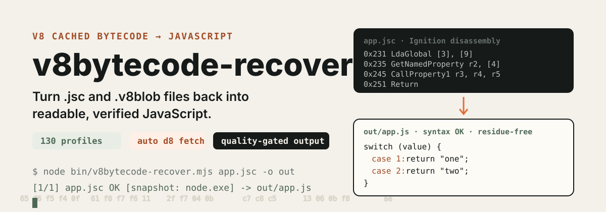

# v8bytecode-recover

  

  <a href="#繁體中文">繁體中文</a> ·
  <a href="#english">English</a>

## 繁體中文

### 它解決甚麼問題

V8 cached bytecode（`.jsc` / `.v8blob`）通常不能直接閱讀，還原結果受 V8 版本、build flags 及 startup snapshot 影響。v8bytecode-recover 將偵測、解碼、source recovery、品質檢查及分析放在同一條 pipeline：由一個檔案或目錄開始，輸出只會在通過 syntax check 及 decompiler-residue check 後寫入，並清楚區分 **成功**、**partial** 及 **failed**。

本專案參考了 [xqy2006/jsc2js](https://github.com/xqy2006/jsc2js) 及 [suleram/View8](https://github.com/suleram/View8) 的 source-recovery 方向，並加入它們沒有的部分：輸出品質閘門、generator/async 重構、自動 d8 取得及可重播 artifact。

### 30 秒開始

需求：Windows PowerShell、Node.js 18+；處理 raw blob 時需要 Python 3。沒有 runtime npm dependency。

~~~powershell
cd D:\path\to\v8bytecode-recover
.\v8bytecode-recover.ps1
~~~

選擇 **Quick recover**，輸入檔案或目錄，其他用自動預設。如果 Windows PowerShell 不允許執行 `.ps1`：

~~~powershell
powershell.exe -NoProfile -ExecutionPolicy Bypass -File .\v8bytecode-recover.ps1
~~~

主入口預設繁體中文；`.\v8bytecode-recover-zh-CN.ps1` 或 `-Language zh-CN` 使用簡體。

Script、CI 或批次流程：

~~~powershell
.\v8bytecode-recover.ps1 -Action recover -InputPath .\input -OutputPath .\output
# 或直接使用 Node CLI
node .\bin\v8bytecode-recover.mjs .\input -o .\output
~~~

成功輸出：

~~~text
input/           output/
└─ app.jsc       ├─ app.js
                 ├─ recovery-report.json
                 └─ recovery-manifest.json
~~~

### Pipeline

1. 偵測輸入格式：.v8blob、.jsc、disassembly text 或 .v8recovery.json
2. 自動選擇 V8 profile，搜尋 matching startup snapshot 或 Node read-only heap
3. 解碼 bytecode，還原控制流、函式、作用域及常見 JavaScript 結構（含整數 jump-table switch、try/catch、generator/async）
4. 執行 syntax、residue 及 closure-binding 檢查
5. 輸出 JavaScript、報告、manifest 及可選的函式分析資料

### 輸入與輸出

| 類型 | 支援 |
| --- | --- |
| Raw input | .v8blob、.jsc |
| Text input | .disassembly.txt、.disasm.txt、.txt |
| Replay input | .v8recovery.json |
| Source output | 通過品質檢查的 *.js |
| Analysis | *.functions.json、*.callgraph.json、*.tree.json、*.inline.json、*.names.json |
| Evidence | *.disassembly.txt、*.translated.txt、*.cfg.json |
| Run state | recovery-report.json、recovery-manifest.json |

### 常用命令

查看 blob header、V8 profile、snapshot 候選及 hash：

~~~powershell
.\v8bytecode-recover.ps1 -Action inspect -InputPath .\input\app.jsc
~~~

嚴格模式：任何 unresolved read-only reference 都不輸出 JavaScript：

~~~powershell
.\v8bytecode-recover.ps1 -Action recover -InputPath .\input -OutputPath .\output -Strict
~~~

輸出函式索引及 graph：

~~~powershell
node .\bin\v8bytecode-recover.mjs .\input --emit functions,callgraph,tree,names
~~~

大型目錄可使用 resume；輸入、設定或輸出被改動時，舊結果會自動失效：

~~~powershell
.\v8bytecode-recover.ps1 -Action recover -InputPath .\input -OutputPath .\output -Resume
~~~

如果目標 blob 仍有無法安全還原的 residue，研究模式保留候選檔於 `.research/`，不會把它誤標成 `.js`：

~~~powershell
node .\bin\v8bytecode-recover.mjs .\input --research --report .\output\research.json
~~~

產生可重用 artifact，之後可在沒有 Python 或 d8 的情況下重播：

~~~powershell
.\v8bytecode-recover.ps1 -Action recover -InputPath .\input -OutputPath .\artifacts -Emit serialized
~~~

### Matching d8 與 profiles

- 內建 **130 個 exact profiles** 覆蓋 V8 5.1 至 15.3。`npm run profiles:list` 查看、`npm run profiles:validate` 驗證。
- 目標 build 不在內建目錄時，工具由 blob 的 version hash 計算 V8 tag，**自動下載** matching patched d8（約 8 MB，放在 git-ignored 的 `runtime/d8/`，同一版本只下載一次）。`--no-d8-download` 停用。
- Node、Electron、Chromium 及 custom embedder 的判定規則集中在 `engine/v8asm/cached_data/embedder-matrix.json`；對非 Node embedder，只有 version hash 不足以宣稱 exact，auto backend 會優先使用 matching d8。

~~~powershell
$env:V8BYTECODE_D8 = 'D:\tools\d8-14.7.exe'   # 指定本機 d8（可省略）
node .\bin\v8bytecode-recover.mjs .\input\app.jsc
# 或明確指定：
.\v8bytecode-recover.ps1 -Action recover -InputPath .\input\app.jsc -Backend d8 -D8Path D:\path\to\d8.exe
~~~

由 upstream V8 tag 自動找出每條 minor line 的最新 exact tag，並生成候選 profiles：

~~~powershell
node .\bin\v8bytecode-profiles.mjs discover --minimum 5.1.0 --maximum 15.3.79 --output .\temp\v8-versions.txt
node .\bin\v8bytecode-profiles.mjs generate --version 14.7.84
~~~

生成結果放在 `output\profiles\VERSION` 並附 generation report；不會自動覆蓋 bundled profiles。維護規則見 [`docs/PROFILE_GENERATION.md`](./docs/PROFILE_GENERATION.md)。

### 限制

- V8 cached bytecode 是 version、build flags 及 startup snapshot 敏感格式；匹配版本仍然重要。
- 輸出是語義近似源碼，不是原始檔案的逐字副本；原始註解、排版及部分 identifier names 不存在於 bytecode 中。
- 缺少 read-only snapshot 時，預設可輸出有明確標記的 partial source；`-Strict` 改為零容忍。
- 非 read-only residue、未知 opcode、invalid syntax 或 closure binding 問題會令該檔案失敗，不會冒充成功輸出。唯一例外是個別函式的 decompiler fallback（保留為註解形式的線性 bytecode），report 會標記為 partial recovery。
- 研究模式的失敗候選位於 `.research/`，只作人工分析，不是品質通過的 JavaScript。

### 專案結構

~~~text
v8bytecode-recover.ps1    PowerShell 主入口（預設繁體中文）
powershell/               PowerShell actions、menu、localization、Node runner
bin/                      recover、inspect、doctor、profiles、benchmark CLI
src/                      CLI、pipeline、analysis、backends、validation 及 reporting
engine/v8asm/             V8 profiles、cached-data decoder、source recovery
docs/                     profile 生成指南、命令例子及 benchmark 設定
test/                     Node 內建測試
~~~

### 開發與驗證

本專案沒有 runtime npm dependency：

~~~powershell
npm run check
npm test
npm run profiles:validate
python -B -m unittest discover -s engine/v8asm -p 'test_*.py'
~~~

## English

v8bytecode-recover is a PowerShell-first recovery pipeline for V8 cached bytecode. It turns `.v8blob`, `.jsc`, disassembly text, or validated recovery artifacts into readable approximate JavaScript, then applies syntax and decompiler-residue gates before writing source files.

Compared with the View8-style tools it builds on, it adds output quality gates, generator/async restructuring, automatic matching-d8 acquisition, and replayable serialized artifacts.

### Quick start

Requirements: Windows PowerShell, Node.js 18+, Python 3 for raw blobs. No runtime npm dependency.

~~~powershell
.\v8bytecode-recover.ps1
node .\bin\v8bytecode-recover.mjs .\input -o .\output
~~~

The PowerShell entry defaults to Traditional Chinese; use `v8bytecode-recover-zh-CN.ps1` or `-Language zh-CN` for Simplified. The inspect, doctor, and profile CLIs also accept `--language zh-TW|zh-CN`.

Inspect an input before recovery to see the detected header layout, hash candidates, snapshot candidates, and embedder evidence:

~~~powershell
node .\bin\v8bytecode-inspect.mjs .\input\app.jsc --json
node .\bin\v8bytecode-profiles.mjs identify .\input\app.jsc --json
~~~

Unknown header layouts are reported as ranked evidence instead of being silently mapped to a nearby V8 release. For a V8 version outside the bundled catalog, generate and validate an exact profile pack automatically:

~~~powershell
node .\bin\v8bytecode-profiles.mjs generate --version 14.7.84
~~~

See [`docs/PROFILE_GENERATION.md`](./docs/PROFILE_GENERATION.md) for the maintenance workflow and [`docs/RECIPES.md`](./docs/RECIPES.md) for command recipes, including resolving Node read-only heap values.

### What makes it useful

- Built-in profile backend for supported V8 cached-data formats; 130 exact profiles from V8 5.1 through 15.3.
- Automatic d8 acquisition: the blob's version hash maps to its exact V8 tag and a matching patched release build downloads on demand (`--no-d8-download` disables).
- Snapshot discovery for modern startup snapshots, legacy embedded Node snapshots, and read-only heaps inside Node/Electron binaries — including the running Node binary itself.
- Quality gates that separate success, partial recovery, and failure; per-function decompiler failures keep commented linear output instead of discarding the file (`--strict` restores zero tolerance).
- Recovery of switch statements from integer jump tables, handler-table try/catch, generators, and async functions.
- Reusable serialized artifacts for replay without Python or d8.
- Function indexes, nested hierarchy, call/reference graphs, trees, and deterministic name maps.
- Scope-limited, bounded inline, and show-all research views; preserved non-clean candidates under `.research/` without publishing them as `.js`.
- External two-stage benchmark adapters for patched d8 plus View8-style tools, with syntax, residue, function-count, profile, embedder, and byte-size gates:

~~~powershell
node .\bin\v8bytecode-benchmark.mjs D:\corpus\v8 --backends profile,d8 --fail-on-regression --output .\output\benchmarks\v8.json
~~~

### Important limitations

V8 cached bytecode depends on its V8 version, build flags, and startup snapshot. Recovered output is a semantic reconstruction, not a byte-for-byte copy of the original source. Names, comments, formatting, optimized expressions, and some control-flow structure may not be recoverable. Use `--strict` when partial output is not acceptable.

## References

- [xqy2006/jsc2js](https://github.com/xqy2006/jsc2js) — reference V8 code-cache recovery workflow.
- [suleram/View8](https://github.com/suleram/View8) — related bytecode source-recovery project.
- [V8](https://github.com/v8/v8) — upstream engine and bytecode implementation.

## License

MIT. The engine/v8asm directory retains its original license notice.
